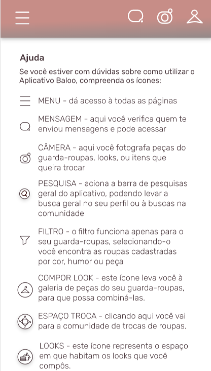

## Objetivo

A tela de ajuda contem as informações usadas para orientar o usuário a respeito da navegação e das funcionalidades presentes no aplicativo. O grupo deve replicar o design presente nas imagens abaixo.

## Imagens

 
