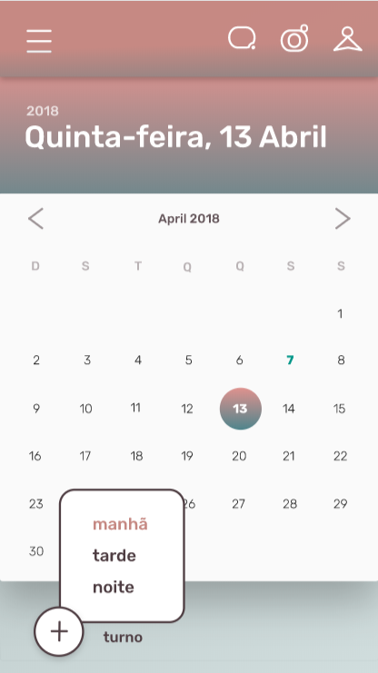
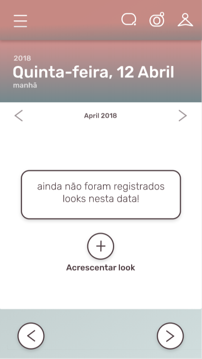

## Objetivo

O objetivo dessa tela é exibir um calendário para o usuário, oferecendo a ele uma opção para adicionar looks a um turno de um determinado dia.

## Funcionalidades 

Implementar uma view em forma de calendário (ver a primeira imagem abaixo).

Implementar uma view que permite a adição de um look a um turno do dia selecionado (ver a segunda imagem abaixo).

## Imagens

