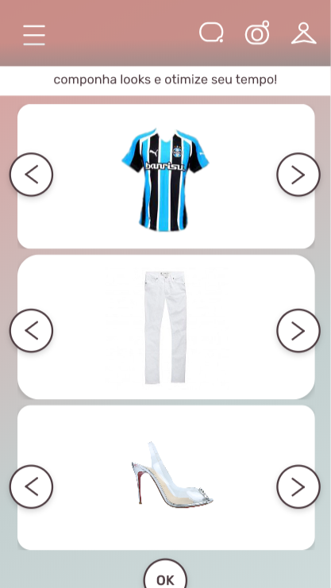

## Objetivo

Essa tela é onde o usuário seleciona peças de roupa do seu guarda-roupas pessoal para compor um novo look. Para isso o usuário deve selecionar 3 peças de roupas: uma camiseta, uma calça e um calçado.

## Funcionalidades

Devem ser criados três espaços (`Views`) distintos. cada um deles deve conter os itens do guarda roupas de uma categoria; um para as camisetas (`torso`), um para as calças (`legs`) e outro para os sapatos (`feet`). 

Cada um desses espaços deve conter uma lista com todos os itens de sua respectiva classificação. Esses itens devem ser percorridos e mostrados na tela, um por vez, ao apertar nos botões laterais (ver imagem abaixo).

:warning: **ATENÇÃO**: Leve em consideração os diferentes tamanhos de tela (responsividade).

## Navegação

Quando o usuário apertar o botão OK, o look montado por ele deve ser enviado para a API para ser salvo no banco de dados.

O usuário, então, é direcionado para a tela de looks, onde o look recém inserido deve aparecer.

## Imagens

