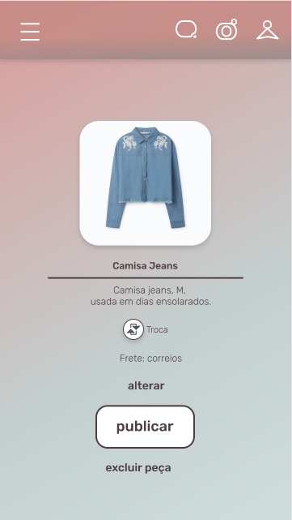

## Objetivo

Essa tela é responsável por exibir todos os detalhes de uma peça de roupa (lista completa abaixo). Ela é exibida quando o usuário seleciona uma peça no seu guarda-roupas.

Os detalhes que devem ser exibidos são:
* Foto principal da peça
* Modelo
* Marca (fabricante)
* Descrição

## Funcionalidades

A tela deve apenas exibir as informações da peça e um botão de `OK` que, quando clicado, deve levar a página anterior.

## Imagens

:warning: **ATENÇÃO**: Use a imagem abaixo como exemplo. Adapte o seu layout para a descrição especificada acima.

