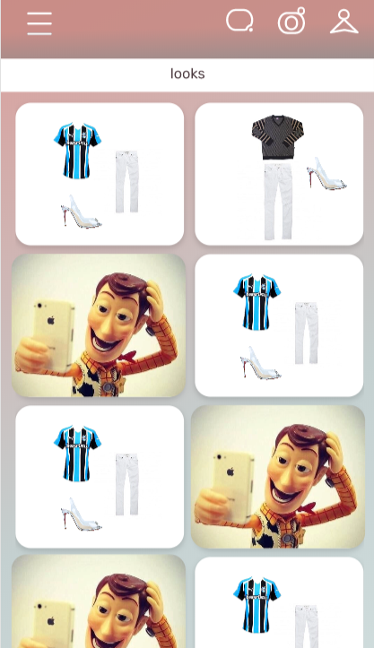

## Objetivo

O objetivo dessa tela é apresentar para o usuário todos os seus looks.

## Funcionalidades 

Todos os looks do usuário devem ficar organizados em uma `FlatList`. Cada look deve ser composto por uma foto de cada uma das três peças que o compões (conforme as imagens com fundo branco na screenshot abaixo).

:warning: **ATENÇÃO**: Leve em consideração os diferentes tamanhos de tela (responsividade).

## Imagens

