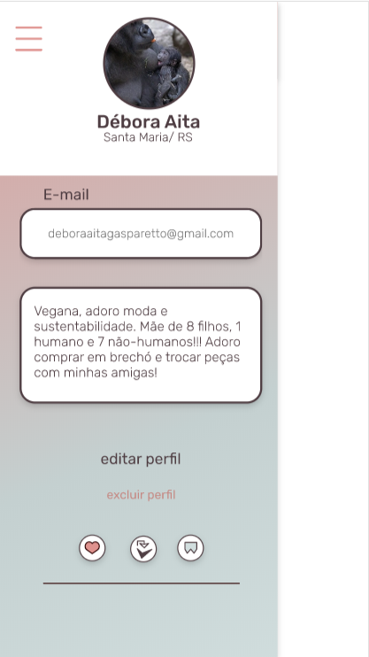

## Objetivo

O objetivo dessa tela é exibir ou editar as informações do usuário. Essas informações incluem:
* Foto
* Nome
* Localização
* E-mail
* Biografia

## Funcionalidades 

A tela deverá, inicialmente, exibir todas as informações mencionadas acima, oferencendo um botão para editar os dados. Quando o botão for pressionado, a tela deve permitir que o usuário edite os seguintes campos:
* Foto
* Localização
* Biografia

As demais informações também devem aparecer na tela de edição, mas de forma somente leitura (`read-only`).

:warning: **ATENÇÃO**: Use a imagem abaixo como exemplo. Adapte o seu layout para a descrição especificada acima. Os ícones e o botão de excluir a conta não são necessários.

## Imagens

