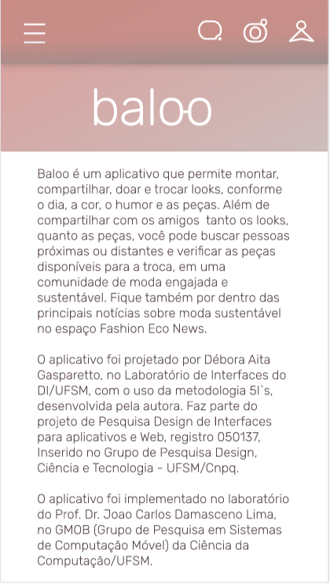

## Objetivo

A tela sobre contem as informações a respeito do aplicativo. Nela deve conter apenas o texto disponibilizado abaixo, dentro de uma `ScrollView`.

> Baloo é um aplicativo que permite montar, compartilhar, doar e trocar looks conforme o dia, a cor, o humor e as peças. Além de compartilhar com os amigos seus looks e peças, você pode buscar pessoas próximas ou distantes e verificar as peças disponíveis para a troca, em uma comunidade de moda engajada e sustentável. Fique também por dentro das principais notícias sobre moda sustentável no espaço Fashion Eco News. O aplicativo foi projetado por Débora Aita Gasparetto, no Laboratório de Interfaces do DI/UFSM, com o uso da metodologia 5I's, desenvolvida pela autora. Faz parte do projeto de Pesquisa Design de Interfaces para aplicativos e Web, registro 050137, Inserido no Grupo de Pesquisa Design, Ciência e Tecnologia - UFSM/Cnpq. O aplicativo foi implementado pelos membros do Grupo de Pesquisa em Sistemas de Computação Móvel (GMob) e pelos alunos da disciplina de Sistemas de Computação Móvel sob a coordenação do Prof. Dr. Joao Carlos Damasceno Lima. Verifique nas configurações a versão acessível para pessoas com baixa visão.

## Imagens

